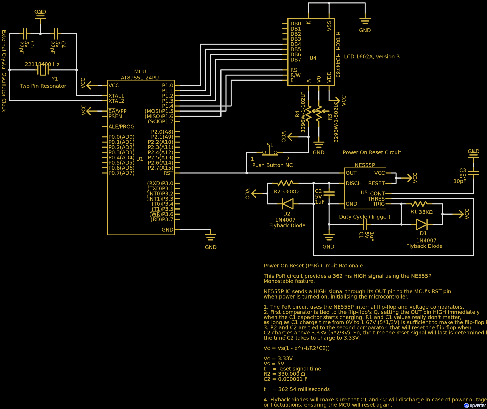

# HD44780 library for sdcc targeting 8051 Intel-based Microntrollers

Original code forked from https://github.com/apachiww/hd44780_for_sdcc_51. Quoting: *"(a library) suitable for 8051 based MCUs with various crystals and instruction cycles (1T, 6T, 12T) as AUTOMATIC delay calculation is available."*   

The original repository aimed to be a common library for many different LCD displays (0801, 0802, 1601, 1602, 2004, Noritake CU20045). This fork focus on specific LCD *circuit modules*, e.g.:  

1. The LCD 1602A, version 3, with 4/8 bit interface.
2. The LCD 1602A, version 3, with I2C interface.  

There is little to no modifications to the original source code. The actual purpose of this fork is to:  

1. Provide more testing (particularly the LCD initialization delay functions).  
2. Validate different hardware interfaces (4 bits, 8 bits and I2C communication).  
3. Offer better build and deploy automation, using Makefiles and avrdude and flash programmers.  
4. Offer better structured header and source files, so there is no need to manually copy the source file for the different interfaces.  
5. Provide PCB schematics to build 8051-based development boards (TBD - in another git repository).  

Projects were tested on an Atmel AT89S51, although others are theoretically supported - see [conf/AT89S5x.conf](conf/AT89S5x.conf). A configuration using an external EEPROM was set to test possible performance impact in the LCD initialization delay functions.  

# Build and Deploy

## [lcd1602_at89s51_4pinbus](lcd1602_at89s51_4pinbus)

This circuit is an example of LCD 1602A 4 bit interface.  

### 4 bit Circuit Configuration  

  
Obs: Although the SN74LS373 and EEPROM chips, together with the data/address multiplexed bus cables (orange, yellow, blue and purple wires) show on the board, notice that the MCU is reading instructions from its internal flash memory (EA pin is connected to VCC).  
  
Available at https://upverter.com/design/mpeschke/1d90df03c47b8130/at89s51-hd44780-4bits/  

> Usage:
>
> 1. Get your hands on a AVRISP capable of flashing hex files to a AT89S51 microcontroller. There are several tutorials out there, the most popular are the ones using [Arduino](https://www.youtube.com/watch?v=Pdi-q-bamlI).
>
> 2. [Place the microcontroller on the AVRISP board](https://www.youtube.com/watch?v=isPWwbw70vc) (follow instructions until 02:47).  
>
> 3. Edit [lcd1602_at89s51_4pinbus/Makefile](lcd1602_at89s51_4pinbus/Makefile) to have your USB port in the `usb_port` variable.
>
> 4. From a terminal, run the commands:
> 
> 5. cd [lcd1602_at89s51_4pinbus](lcd1602_at89s51_4pinbus/)
>
> 6. make

The make command will:  

> 1. build the source code.  
>
> 2. flash the HEX file into the microcontroller's flash memory.  

  

Remove the microcontroller from the AVRISP board and place it in its [circuit](#4-bit-circuit-configuration).  

## [lcd1602_at89s51_4pinbus_extrom](lcd1602_at89s51_4pinbus_extrom)

This circuit is an example of LCD 1602A 4 bit interface, but code is accessed from an external EEPROM.  

### External EEPROM 4 bit Circuit Configuration

  
  
Available at https://upverter.com/design/mpeschke/917442ed3dc5514a/at89s51-hd44780-4bits-ext-eeprom/    

> Usage:
>
> 1. Get your hands on a Flash Programmer. The Batronix Barlino II was used for this project.  
>
> 2. From a terminal, run the commands:
> 
> 3. cd [lcd1602_at89s51_4pinbus_extrom](lcd1602_at89s51_4pinbus_extrom/)
>
> 4. make build_hex
>
> 5. Follow your Flash Programmer instructions to flash the [lcd1602_at89s51_4pinbus_extrom/main_lcd1602.hex](lcd1602_at89s51_4pinbus_extrom/main_lcd1602.hex) into the EEPROM chip.  

  

  

Remove the EEPROM from the Flash Programmer and place it in its [circuit](#external-eeprom-4-bit-circuit-configuration).  

## [lcd1602_led_test](lcd1602_led_test)

This circuit visually validates the LCD initialization delay functions. A blinking LED on microcontroller's port P1_5 in a 1 (one) second interval, using a 12 MHz crystal oscillator.  

### Circuit configuration

  
Available at https://upverter.com/design/mpeschke/6ed6139609f5693d/at89s51-hd44780-led-test-ext-eeprom/

> Usage:
>
> 1. Get your hands on a Flash Programmer. The Batronix Barlino II was used for this project.  
>
> 2. From a terminal, run the commands:
>
> 2. cd [lcd1602_led_test](lcd1602_led_test/)
>
> 4. make build_hex
>
> 5. Follow your Flash Programmer instructions to flash the [lcd1602_led_test/main_lcd1602.hex](lcd1602_led_test/main_lcd1602.hex) into the EEPROM chip.  

Remove the EEPROM from the Flash Programmer and place it in its circuit.  